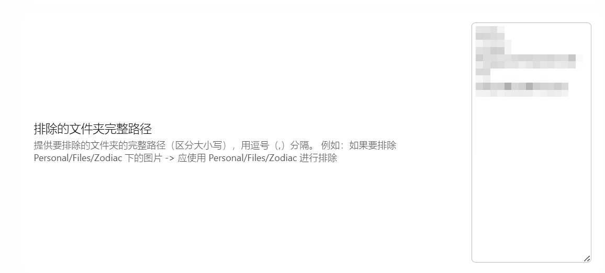
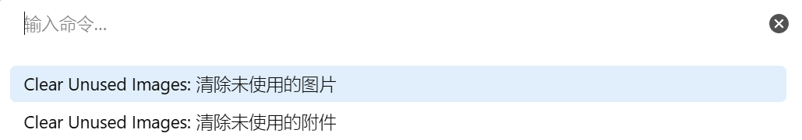
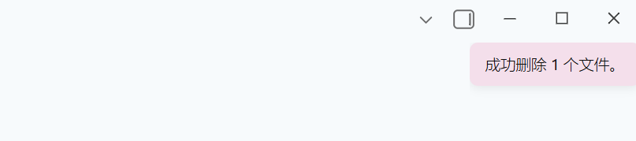
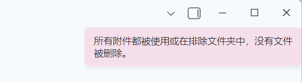

# Obsidian 清除未使用图片插件

本插件通过删除不再在 Markdown 笔记中引用的图片，帮助您保持 vault 的整洁。

插件会获取所有 Markdown 文档中的图片链接，并与 vault 中可用的所有图片文件进行比较。

如果任何图片文件没有在 vault 的任何文档中被引用，它们将被自动删除。

## 🌍 国际化 (i18n)

本插件现在支持多种语言！界面将根据您的 Obsidian 语言设置自动切换。

**支持的语言:**
- ✅ English (默认)
- ✅ 简体中文
- ✅ 繁體中文 (繁体中文)

## 设置

### 功能区图标 (Ribbon Icon)

如果您希望显示清除图片的功能区图标，请打开此选项。

### 删除日志 (Delete Logs)

如果您不想在删除完成后查看删除日志弹窗，请关闭此选项。如果没有删除任何图片，则不会出现此弹窗。

### 已删除图片的目标位置

请确保在"清除图片设置"标签下选择已删除图片的目标位置。您有 3 个选项:


1. **移动到 Obsidian 回收站** - 文件将被移动到 Obsidian Vault 下的 `.trash` 文件夹。

2. **移动到系统回收站** - 文件将被移动到操作系统的回收站。

3. **永久删除** - 文件将被永久销毁，无法恢复。

### 排除的文件夹

您可以排除某些文件夹，在扫描过程中不会移除这些文件夹中的图片。如果需要排除多个文件夹，可以用逗号分隔。请确保提供 vault 中的完整路径:



您现在可以排除上述提供的文件夹路径下的所有子文件夹:


### 忽略特定文件

运行清理时，您将看到一个模态框，显示所有未使用的文件及其复选框。对于每个文件，您可以点击 **"忽略此文件"** 按钮，永久性地将其排除在未来的扫描之外。被忽略的文件路径将保存在插件的 data.json 文件中，不会再出现在未使用文件列表中。

当您想保留某些未使用的图片在 vault 中，而不想在每次运行清理时都被标记出来，这个功能非常有用。

## 使用方法

1. 在社区插件中激活本插件

2. 您可以选择以下任一方式:

    - 在插件设置中启用功能区图标，然后点击左侧功能区中的图标来运行清理:


    - 或使用功能区图标或打开命令面板 (使用 `Ctrl/Cmd + P` 或从功能区),运行"清除未使用的图片"。



3. 如果您在插件设置中打开了"删除日志"选项，您将看到一个弹窗，显示哪些图片已从 vault 中删除:



如果所有图片都在使用中，您将看到如下提示:



**扫描的图片格式**: jpg, jpeg, png, gif, svg, bmp, webp

## 计划功能

-   [x] 创建用户选择已删除文件目的地的设置
-   [x] 扫描的排除文件夹设置
-   [x] **国际化 (i18n) 支持** ✨ 新功能!
-   [ ] 如果用户选择，在加载 vault 期间清理图片
-   [ ] 每 X 分钟清理一次图片 (由用户选择)

## 开发

### 构建插件

```bash
# 安装依赖
npm install

# 开发模式 (监听)
npm run dev

# 生产环境构建
npm run build
```

### 添加新翻译

我们欢迎贡献更多语言支持! 有关如何添加新翻译的详细说明，请参阅 [I18N_GUIDE.md](./I18N_GUIDE.md)。

## 许可证

MIT License

## 致谢

特别感谢所有贡献者和 Obsidian 社区的支持!


